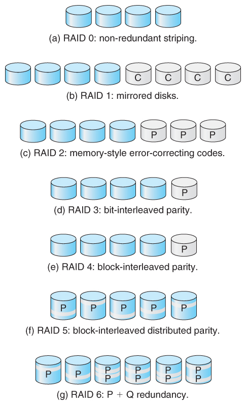

 [1 Introducción](#Introducción)

 

1 Introducción
------------

 

-   Los siguientes ejercicios se realizarán en clase. A modo de guión se pondrán
    aquí todos los procesos para que los alumnos puedan consultar los
    conocimientos de forma más sencilla.

-   En los pdfs en **Contenidos** se muestran varias capitulos que, a modo de
    extensión, podéis consultarlos porque es un libro bastante interesante y el
    que se usa para la **certificación MCSA**.

-   Se utilizará un VM de Windows 10 Enterprise como base.

-   Es necesaria una ISO de la W10 Ent y una iso de debian.

-   Al final se hará un lab de repaso general si hay tiempo.

-   Para el examen de la Unidad 2, será práctico y se partirá de una Windows 10
    Enterprise limpia, a lo sumo con las VMware tools instaladas.

-   En el examen se pedirá una serie de comandos y acciones basados en los
    siguientes ejercicios.

-   Se entregará una parte de papel y otra digital con capturas.

-   No habrá conexión a internet.

-   La ayuda del sistema será el único material, además de la propia MV.

 

 

Configuración de Hyper-V, VMWare
--------------------------------

 

### Ejercicio 1. Activar la característica Hyper-V

 

Client Hyper-V permite ejecutar máquinas virtuales con Windows 10. Hay varias
razones para querer hacer esto, que incluyen:

 

-   Client Hyper-V permite ejecutar máquinas virtuales en su computadora con
    Windows 10. Hay varias razones para querer hacer esto, que incluyen:

-   Querer ejecutar múltiples sistemas operativos en una sola computadora.
    computadora.

-   Admite aplicaciones antiguas que no funcionan correctamente cuando se
    ejecutan de forma nativa en Windows 10. cuando se ejecutan de forma nativa
    en Windows 10.

-   Creando un ambiente de prueba o entrenamiento que no afectará su máquina de
    producción. máquina de producción.

-   Básicamente es como un VMWare Workstation o un Oracle VM, pero en su versión
    Microsoft.

 

**Instalación del rol de Client Hyper-V**

 

-   Abra el Panel de control, haga clic en Programas y características, y luego
    haga clic en Activar o desactivar las características de Windows.

-   Seleccione la casilla de verificación de Hyper-V y haga clic en Aceptar. Los
    archivos se copian Debe reiniciar su computadora antes de poder administrar
    la máquina virtual.

-   También puede usar el siguiente cmdlet de Windows PowerShell para instalar
    la función Hyper-V:

 

~~~~~~~~~~~~~~~~~~~~~~~~~~~~~~~~~~~~~~~~~~~~~~~~~~~~~~~~~~~~~~~~~~~~~~~~~~~~~~~~
Enable-WindowsOptionalFeature -Online -FeatureName Microsoft-Hyper-V -All
~~~~~~~~~~~~~~~~~~~~~~~~~~~~~~~~~~~~~~~~~~~~~~~~~~~~~~~~~~~~~~~~~~~~~~~~~~~~~~~~

 

Para deshabilitar dicha característica basta con realizar el siguiente comando:

 

~~~~~~~~~~~~~~~~~~~~~~~~~~~~~~~~~~~~~~~~~~~~~~~~~~~~~~~~~~~~~~~~~~~~~~~~~~~~~~~~
Disable-WindowsOptionalFeature -FeatureName Microsoft-Hyper-V 
~~~~~~~~~~~~~~~~~~~~~~~~~~~~~~~~~~~~~~~~~~~~~~~~~~~~~~~~~~~~~~~~~~~~~~~~~~~~~~~~

 

-   Ahora se está preparado para configurar MVs

 

Configuración de discos virtuales
---------------------------------

 

### Ejercicio 2. Instalar una iso en VHD en VMWARE.

 

-   Crear y configurar un VHD de arranque nativo

-   Crear y configurar un VHD de arranque nativo Los pasos necesarios para
    preparar un VHD deben realizarse con cuidado; de lo contrario, el VHD no
    estará presente durante el proceso de instalación. Para preparar un VHD de
    inicio nativo, primero créelo y configúrelo para que Windows se instale en
    él.

 

-   Realice los siguientes pasos:

 

1.  Escriba diskmgmt.msc en el área de búsqueda o haga clic con el botón derecho
    en el botón Inicio y haga clic en Administración de discos.

2.  En Administración de discos, haga clic en Acción y luego haga clic en Crear
    VHD.

3.  En el cuadro de diálogo Crear y adjuntar disco duro virtual, proporcione los
    parámetros para su VHD.

 

Un ejemplo de VHD es:

 

\- Ubicación C:  VHD  Windows10vhd.vhd.

\- Tamaño del disco duro virtual: 40 GB.

\- Formato del disco duro virtual: VHD.

\- Tipo de disco duro virtual: tamaño fijo.

 

1.  Haga clic en Aceptar para crear su VHD.

 

Debido a que se seleccionó el tipo fijo, esto podría tomar varios minutos para
completarse, y verá el progreso de la creación en la esquina inferior derecha
del cuadro de diálogo Administración de discos. Su nuevo VHD debe conectarse
automáticamente al sistema. Si no es así, puede usar Administración de discos
para adjuntarlo.

 

Use Disk Management para conectar un VHD Su nuevo VHD se debe conectar
automáticamente al sistema, de lo contrario, use Administración de discos para
conectar el disco de la siguiente manera.

 

1.  Haga clic en Acción y luego en Adjuntar VHD, busque su nuevo VHD y elija el
    VHD que desee adjuntar.

2.  Si prefiere usar la línea de comando, también puede usar la herramienta
    DiskPart y escribir create vdisk file = C:  VHD  Windows10vhd.vhd maximum =
    40960 type = fixed para lograr el mismo resultado.

3.  Deje la unidad VHD en el estado No inicializado; esto se actualiza cuando
    Windows se instala en él.

 

Windows ahora puede instalar en el archivo VHD.

 

Instalar Windows dentro de un VHD Para instalar Windows dentro de su archivo
VHD, siga estos pasos.

 

1.  Inserte su medio de Windows (o ISO si está usando una máquina virtual) en su
    computadora y arranque desde allí.

2.  Siga las indicaciones en pantalla, proporcionando la información adecuada
    hasta que aparezca la pantalla Dónde desea instalar Windows.

3.  Presione Shift + F10 para abrir una ventana de símbolo del sistema
    administrativo.

4.  En la ventana del símbolo del sistema administrativo, escriba DiskPart .

5.  En DiskPart, escriba List disk .

6.  Ubique el disco VHD que ha creado y escriba

 

**Resumiendo comandos:**

 

-   Creación de un disco virtual VHD/VHDX: el siguiente ejemplo crea de forma
    dinámica un disco expandible de tipo VHD en un fichero llamado `test.vhd`.
    El tipo puede ser `expandible` y `fixed`. El primero se puede modificar y el
    segundo no y además es el valor por defecto.

 

~~~~~~~~~~~~~~~~~~~~~~~~~~~~~~~~~~~~~~~~~~~~~~~~~~~~~~~~~~~~~~~~~~~~~~~~~~~~~~~~
create vdisk file=c:\test.vhd maximum=20000 type=expandable
~~~~~~~~~~~~~~~~~~~~~~~~~~~~~~~~~~~~~~~~~~~~~~~~~~~~~~~~~~~~~~~~~~~~~~~~~~~~~~~~

 

-   Montaje de VHD/VHDX (attach): el siguiente ejemplo muestra cómo seleccionar
    y montar el VHD. También se ven los pasos del particionamiento, formato y
    asiganción de letra de la unidad al disco montado.

 

~~~~~~~~~~~~~~~~~~~~~~~~~~~~~~~~~~~~~~~~~~~~~~~~~~~~~~~~~~~~~~~~~~~~~~~~~~~~~~~~
select vdisk file=c:\test.vhd
attach vdisk
create partition primary
format fs=ntfs label="Test VHD" quick
assign letter=v
~~~~~~~~~~~~~~~~~~~~~~~~~~~~~~~~~~~~~~~~~~~~~~~~~~~~~~~~~~~~~~~~~~~~~~~~~~~~~~~~

 

-   Desmontaje de disco VHD

 

~~~~~~~~~~~~~~~~~~~~~~~~~~~~~~~~~~~~~~~~~~~~~~~~~~~~~~~~~~~~~~~~~~~~~~~~~~~~~~~~
select vdisk file=c:\test.vhd
detach vdisk
~~~~~~~~~~~~~~~~~~~~~~~~~~~~~~~~~~~~~~~~~~~~~~~~~~~~~~~~~~~~~~~~~~~~~~~~~~~~~~~~

 

**Estos pasos se pueden realizar en el Administrador de Discos de la MMC**

 

~~~~~~~~~~~~~~~~~~~~~~~~~~~~~~~~~~~~~~~~~~~~~~~~~~~~~~~~~~~~~~~~~~~~~~~~~~~~~~~~
c:\DiskPart
diskpart>
~~~~~~~~~~~~~~~~~~~~~~~~~~~~~~~~~~~~~~~~~~~~~~~~~~~~~~~~~~~~~~~~~~~~~~~~~~~~~~~~

 

-   Este comando expande o extiende el tamaño del disco duro virtual VHD. Para
    que esto funcione el disco debe estar seleccionado, desmontado (detach) y no
    direfenciado (que no tenga un backup hijo, que no hemos visto). De otro
    modo, encontrarás errores de corrupción de datos en VHD. mientras lo
    intentes crear.

 

~~~~~~~~~~~~~~~~~~~~~~~~~~~~~~~~~~~~~~~~~~~~~~~~~~~~~~~~~~~~~~~~~~~~~~~~~~~~~~~~
expand vdisk maximum=<size in mb>
~~~~~~~~~~~~~~~~~~~~~~~~~~~~~~~~~~~~~~~~~~~~~~~~~~~~~~~~~~~~~~~~~~~~~~~~~~~~~~~~

 

-   Compacta un disco VHD seleccionado para reducir el tamaño. Sólo puede ser
    utilizado con VHDs que son *expandable* y también desmontados, o montados en
    modo lectura.

 

~~~~~~~~~~~~~~~~~~~~~~~~~~~~~~~~~~~~~~~~~~~~~~~~~~~~~~~~~~~~~~~~~~~~~~~~~~~~~~~~
compact vdisk
~~~~~~~~~~~~~~~~~~~~~~~~~~~~~~~~~~~~~~~~~~~~~~~~~~~~~~~~~~~~~~~~~~~~~~~~~~~~~~~~

 

### **Ejemplo de compactado y extensión de vdisks:**

 

~~~~~~~~~~~~~~~~~~~~~~~~~~~~~~~~~~~~~~~~~~~~~~~~~~~~~~~~~~~~~~~~~~~~~~~~~~~~~~~~
DISKPART> select vdisk file=c:\prueba2.vhd

DiskPart seleccionó correctamente el archivo de disco virtual.

DISKPART> list vdisk

  Núm. discoV  Núm. disco  Estado                Tipo       Arch.
  -----------  ----------  --------------------  ---------  -----
* discoV 0    Disco ---  Agregado              Desconocid  c:\prueba2.vhd

DISKPART> attach vdisk

  100 por ciento completado

DiskPart expuso correctamente el archivo de disco virtual.

DISKPART> detach vdisk

DiskPart ocultó correctamente el archivo de disco virtual.

DISKPART> expand vdisk maximum=20000

  100 por ciento completado

DiskPart expandió correctamente el archivo de disco virtual.

DISKPART> compact vdisk

  100 por ciento completado

DiskPart compactó correctamente el archivo de disco virtual.

DISKPART>
~~~~~~~~~~~~~~~~~~~~~~~~~~~~~~~~~~~~~~~~~~~~~~~~~~~~~~~~~~~~~~~~~~~~~~~~~~~~~~~~

 

### Acciones posteriores para arranque e instalación en vdisk

 

-   Después de poder crearlo debe reiniciar el sistema de modo que la BIOS/UEFI
    pueda reconocer una ISO de Windows 10 Enterprise desde un dispositivo
    extraíble.

-   Desde la VMWARE, se para la máquina (Power Off) y se arranca desde la BIOS:
    Power On Firmware.

-   Se seleccion las opciones de arranque el dispositivo extraíble donde esté la
    ISO y se inicia la MV.

-   Después, en el arranque de instalación de Windows 10, se procede a la
    instalación y se pasa a la fase donde están los discos para instalar. Se
    pulsa `Shift+F10` t aparcerá la consola de comandos.

-   Pasa a la unidad donde estén los discos virtuales y entre en la aplicación
    `Diskpart`.

 

~~~~~~~~~~~~~~~~~~~~~~~~~~~~~~~~~~~~~~~~~~~~~~~~~~~~~~~~~~~~~~~~~~~~~~~~~~~~~~~~
select vdisk file = D:\VHD\Windows10vhd.vhd 
~~~~~~~~~~~~~~~~~~~~~~~~~~~~~~~~~~~~~~~~~~~~~~~~~~~~~~~~~~~~~~~~~~~~~~~~~~~~~~~~

 

(Tenga en cuenta que la letra de la unidad ha sido modificada).

 

1.  En DiskPart, escriba `attach vdisk` y presione Enter.

2.  Escriba Salir para cerrar DiskPart y luego cierre la ventana del símbolo del
    sistema administrativo.

3.  En la página Dónde desea instalar Windows, haga clic en Actualizar. Su disco
    VHD debería aparecer ahora.

4.  Seleccione la unidad VHD y permita que Windows se instale normalmente.

 

Después de reiniciar la máquina, debería ver la posibilidad de elegir un sistema
operativo durante el tiempo de arranque, como se muestra

 

Modificación del arranque del sistema
-------------------------------------

 

### Ejercicio 3. Modifcar arranque con BCDEDIT

 

-   El comando **BCDEDIT** tiene como función modificar el arranque de sistemas
    Windows.

-   Se necesita iniciar el CMD con privilegios de Administrador.

-   Para visualizar la ayuda del comando:

 

~~~~~~~~~~~~~~~~~~~~~~~~~~~~~~~~~~~~~~~~~~~~~~~~~~~~~~~~~~~~~~~~~~~~~~~~~~~~~~~~
bcdedit /?
~~~~~~~~~~~~~~~~~~~~~~~~~~~~~~~~~~~~~~~~~~~~~~~~~~~~~~~~~~~~~~~~~~~~~~~~~~~~~~~~

 

-   Para visualizar todas las entradas del boot manager:

 

~~~~~~~~~~~~~~~~~~~~~~~~~~~~~~~~~~~~~~~~~~~~~~~~~~~~~~~~~~~~~~~~~~~~~~~~~~~~~~~~
bcdedit /v
~~~~~~~~~~~~~~~~~~~~~~~~~~~~~~~~~~~~~~~~~~~~~~~~~~~~~~~~~~~~~~~~~~~~~~~~~~~~~~~~

 

-   Para ver la ayuda de la opción */createstore*:

 

~~~~~~~~~~~~~~~~~~~~~~~~~~~~~~~~~~~~~~~~~~~~~~~~~~~~~~~~~~~~~~~~~~~~~~~~~~~~~~~~
bcdedit /? /createstore
~~~~~~~~~~~~~~~~~~~~~~~~~~~~~~~~~~~~~~~~~~~~~~~~~~~~~~~~~~~~~~~~~~~~~~~~~~~~~~~~

 

-   El siguiente comando crea un orden que consiste en dos Windows, identificado
    por GUID y por la etiqueta ntldr, que la utilizan sistemas operativos
    Windows más antiguos que Vista :

 

~~~~~~~~~~~~~~~~~~~~~~~~~~~~~~~~~~~~~~~~~~~~~~~~~~~~~~~~~~~~~~~~~~~~~~~~~~~~~~~~
bcdedit /displayorder {802d5e32-0784-11da-bd33-000476eba25f} {cbd971bf-b7b8-4885-951a-fa03044f5d71} {ntldr}
~~~~~~~~~~~~~~~~~~~~~~~~~~~~~~~~~~~~~~~~~~~~~~~~~~~~~~~~~~~~~~~~~~~~~~~~~~~~~~~~

 

-   El siguiente comando pasa el GUID que tenga la instalación del Windows al
    último lugar. También puede ser al primer lugar.

 

~~~~~~~~~~~~~~~~~~~~~~~~~~~~~~~~~~~~~~~~~~~~~~~~~~~~~~~~~~~~~~~~~~~~~~~~~~~~~~~~
bcdedit /displayorder {802d5e32-0784-11da-bd33-000476eba25f} /addlast

bcdedit /displayorder {802d5e32-0784-11da-bd33-000476eba25f} /addfirst
~~~~~~~~~~~~~~~~~~~~~~~~~~~~~~~~~~~~~~~~~~~~~~~~~~~~~~~~~~~~~~~~~~~~~~~~~~~~~~~~

 

-   Si se necesita cambiar la descripción que se va a imprimir en el boot
    manager al iniciar Windows:

 

~~~~~~~~~~~~~~~~~~~~~~~~~~~~~~~~~~~~~~~~~~~~~~~~~~~~~~~~~~~~~~~~~~~~~~~~~~~~~~~~
bcdedit /set {802d5e32-0784-11da-bd33-000476eba25f} description "Windows 10 Lab1"
~~~~~~~~~~~~~~~~~~~~~~~~~~~~~~~~~~~~~~~~~~~~~~~~~~~~~~~~~~~~~~~~~~~~~~~~~~~~~~~~

 

-   Si queremos poner un tiempo en el que permanecerá disponible las opciones
    del boot manager (en segundos):

 

~~~~~~~~~~~~~~~~~~~~~~~~~~~~~~~~~~~~~~~~~~~~~~~~~~~~~~~~~~~~~~~~~~~~~~~~~~~~~~~~
bcdedit /timeout 30
~~~~~~~~~~~~~~~~~~~~~~~~~~~~~~~~~~~~~~~~~~~~~~~~~~~~~~~~~~~~~~~~~~~~~~~~~~~~~~~~

 

-   Si queremos poner por defecto que arranque un determinado sistema:

 

~~~~~~~~~~~~~~~~~~~~~~~~~~~~~~~~~~~~~~~~~~~~~~~~~~~~~~~~~~~~~~~~~~~~~~~~~~~~~~~~
bcdedit /default {cbd971bf-b7b8-4885-951a-fa03044f5d71}
~~~~~~~~~~~~~~~~~~~~~~~~~~~~~~~~~~~~~~~~~~~~~~~~~~~~~~~~~~~~~~~~~~~~~~~~~~~~~~~~

 

-   **BCDEDIT** no es un boot manager para sistemas Linux y, en principio, no es
    compatible, pero sí que se puede utilizar haciendo un simple workarround que
    añade un arranque UEFI desde una partición que se pueda acceder a la imagen
    de Linux. Aunque es recomendable utilizar **Grub2** cuando ya se tienen
    sistemas Windows y Linux coexistiendo. Esto se verá en la parte de Linux,
    segundo trimestre.

 

Creación de dispositivos de almacenamiento para instalación
-----------------------------------------------------------

 

### Ejercicio 4. Preparar un USB con diskpart para instalación.

 

-   Reemplaza x por la unidad de la unidad Flash USB:

 

~~~~~~~~~~~~~~~~~~~~~~~~~~~~~~~~~~~~~~~~~~~~~~~~~~~~~~~~~~~~~~~~~~~~~~~~~~~~~~~~
select disk x
~~~~~~~~~~~~~~~~~~~~~~~~~~~~~~~~~~~~~~~~~~~~~~~~~~~~~~~~~~~~~~~~~~~~~~~~~~~~~~~~

~~~~~~~~~~~~~~~~~~~~~~~~~~~~~~~~~~~~~~~~~~~~~~~~~~~~~~~~~~~~~~~~~~~~~~~~~~~~~~~~
clean # Esto elimina o limpia el contenido de la unidad Flash
~~~~~~~~~~~~~~~~~~~~~~~~~~~~~~~~~~~~~~~~~~~~~~~~~~~~~~~~~~~~~~~~~~~~~~~~~~~~~~~~

~~~~~~~~~~~~~~~~~~~~~~~~~~~~~~~~~~~~~~~~~~~~~~~~~~~~~~~~~~~~~~~~~~~~~~~~~~~~~~~~
create partition primary  # Creamos una partición

list partition            # Listamos la partición

select partition 1        # Seleccionamos la partición 1

ative                     # Marcamos la actual partición como activa

format fs=ntfs quick      # Formateamos la partición

assign letter=H           # Asignamos la letra H, si sólo escribimos assign el sistema asigna una libre.

exit
~~~~~~~~~~~~~~~~~~~~~~~~~~~~~~~~~~~~~~~~~~~~~~~~~~~~~~~~~~~~~~~~~~~~~~~~~~~~~~~~

 

-   Luego entramos en la unidad g:

 

~~~~~~~~~~~~~~~~~~~~~~~~~~~~~~~~~~~~~~~~~~~~~~~~~~~~~~~~~~~~~~~~~~~~~~~~~~~~~~~~
g:
cd boot
bootsect /nt60 h:   # donde h: es la unidad del pendrive
~~~~~~~~~~~~~~~~~~~~~~~~~~~~~~~~~~~~~~~~~~~~~~~~~~~~~~~~~~~~~~~~~~~~~~~~~~~~~~~~

 

-   Copiamos los ficheros:

 

~~~~~~~~~~~~~~~~~~~~~~~~~~~~~~~~~~~~~~~~~~~~~~~~~~~~~~~~~~~~~~~~~~~~~~~~~~~~~~~~
g:\xcopy g:\*.* /s /h /f h:\
~~~~~~~~~~~~~~~~~~~~~~~~~~~~~~~~~~~~~~~~~~~~~~~~~~~~~~~~~~~~~~~~~~~~~~~~~~~~~~~~

 

-   Una vez hecho esto, ya tenemos cualquier sistema Windows arrancable desde
    Flash USB.

-   Existe otra opción, que es utilizar **Rufus**, una aplicación que vale para
    casi cualquier sistema operativo. Pero es gráfica.

 

Particiones MBR y GPT. Volúmenes.
---------------------------------

 

-   MBR (Master Boot Record): creado durante el particionado del disco y ubicado
    en su primer sector, su emplazamiento soporta cuatro particiones
    principales, pero el ordenador solo arrancará desde aquella definida como
    activa (partición del sistema) y contendrá el gestor de arranque. Es posible
    definir más de cuatro particiones, designando una (o más) de las particiones
    principales como extendidas y atribuirle así particiones lógicas para
    almacenar los datos. La BIOS del ordenador requiere cierta tecnología para
    arrancar Windows 10. En caso de que la tabla MBR se corrompa, el sistema no
    podrá arrancar. **El tamaño máximo de las particiones MBR es de 2 TB.**

 

-   GPT (GUID Partition Table): disponible en los ordenadores UEFI, la tabla de
    particiones GPT resuelve las restricciones vinculadas a los discos MBR. A
    diferencia de la estructura anterior, que contiene las referencias LBA
    (Logical Block Address) codificadas en 32 bits, una partición GPT tiene sus
    referencias definidas en 64 bits. Además, una partición del sistema ESP
    (Extensible Firmware Interface System Partition) se almacena en cada disco
    arrancable, al igual que una partición MSR (Microsoft Reserved Partition).
    La tecnología GPT está disponible con Windows Vista, Windows 7, Windows
    Server 2008, Windows Server 2012, Windows 8.1 y Windows 10.

 

Una BIOS en un sistema de 32 o 64 bits se encarga de la lectura de datos de una
partición GPT. En una arquitectura de 64 bits con un sistema UEFI, es posible
utilizar una partición GPT para arrancar Windows 10.

 

Un disco GPT gestiona hasta 128 particiones principales y ofrece una redundancia
para un tamaño de volumen máximo de 18 EB (exabytes).

 

Durante la instalación de Windows 10 en un disco de arranque GPT, este último
crea tres particiones:

 

-   ESP: con un tamaño variable, esta partición contiene el gestor de arranque
    necesario para ejecutar Windows 10. arranque necesario para ejecutar Windows

-   Sistema operativo

-   MSR: partición oculta que no posee ninguna letra de unidad, reservada para
    el funcionamiento de Windows 10. No debe estar encriptada.

 

Tres herramientas permiten administrar las particiones utilizadas por Windows
10: Consola de administración de discos, PowerShell y DiskPart.

 

Por ejemplo, es posible convertir de forma sencilla una partición MBR en una
partición GPT y viceversa, empleando la herramienta DiskPart.

 

### Sistemas de Ficheros

 

| **Sistema de Ficheros** | **Descripción**                                                            |
|-------------------------|----------------------------------------------------------------------------|
| NTFS                    | Sistema de Ficheros empresarial utilizado por más de 20 años               |
| ReFS                    | \- Tamaño máximo de ficheros es de 16 EB. Máximo tamaño de volumen de 1 YB |
| exFAT                   |                                                                            |
| FAT32                   |                                                                            |
| FAT                     |                                                                            |

 

### Ejercicio 5. Creación de Volúmenes mediante Diskpart:

 

**NOTA Importante**: Añadir discos a la VMWARE es sencillo. Pero actualmente sí
que nos funciona hacerlo con la instancia encendida (no como lo dije en clase,
parando la máquina). Eso nos permite realizar operaciones con discos de forma
rápida y sencilla.

 

-   Botón derecho sobre la instancia y seleccionar *Settings*

-   Añadir Hard Disk + SATA ó SCSI + Create new virtual disk + Tamaño elegido.
    El resto de opciones por defecto y finalizar.

-   Visto esto vamos a crear volúmenes.

-   Añadamos 3 discos duros a la MV de 10 GB sin tener que parar la MV, tal y
    como habíamos dicho.

 

-   Lo primero que haremos es seleccionar un disco y luego convertirlo a GPT,
    luego hacerlo dinámico

 

~~~~~~~~~~~~~~~~~~~~~~~~~~~~~~~~~~~~~~~~~~~~~~~~~~~~~~~~~~~~~~~~~~~~~~~~~~~~~~~~
DISKPART> list disk

  Núm Disco  Estado      Tamaño   Disp     Din  Gpt
  ---------- ----------  -------  -------  ---  ---
  Disco 0    En línea        120 GB  5000 MB   *
  Disco 1    En línea         20 GB      0 B        *
  Disco 2    En línea         20 GB    19 GB        *
  Disco 3    En línea         20 GB    19 GB        *
  Disco 4    En línea         10 GB     9 GB        *
  Disco 5    En línea         10 GB      0 B        *
* Disco 6    En línea         10 GB     9 GB        *

DISKPART> select disk 4

DISKPART> convert gpt

DiskPart convirtió correctamente el disco seleccionado en el formato GPT.

DISKPART> convert dynamic

DiskPart convirtió correctamente el disco seleccionado en el formato dinámico.
~~~~~~~~~~~~~~~~~~~~~~~~~~~~~~~~~~~~~~~~~~~~~~~~~~~~~~~~~~~~~~~~~~~~~~~~~~~~~~~~

 

Si queremos volver al principio o borrar el disco, hacemos con el disco
seleccionado:

 

~~~~~~~~~~~~~~~~~~~~~~~~~~~~~~~~~~~~~~~~~~~~~~~~~~~~~~~~~~~~~~~~~~~~~~~~~~~~~~~~
DISKPART> clean
~~~~~~~~~~~~~~~~~~~~~~~~~~~~~~~~~~~~~~~~~~~~~~~~~~~~~~~~~~~~~~~~~~~~~~~~~~~~~~~~

 

Podemos convertirlo a mbr indistintamente:

 

~~~~~~~~~~~~~~~~~~~~~~~~~~~~~~~~~~~~~~~~~~~~~~~~~~~~~~~~~~~~~~~~~~~~~~~~~~~~~~~~
DISKPART> convert mbr
~~~~~~~~~~~~~~~~~~~~~~~~~~~~~~~~~~~~~~~~~~~~~~~~~~~~~~~~~~~~~~~~~~~~~~~~~~~~~~~~

 

Vamos a crear volúmenes para que veáis cómo se realizan . Una vez que tengamos
el volumen dinámico, debemos formatearl.

 

~~~~~~~~~~~~~~~~~~~~~~~~~~~~~~~~~~~~~~~~~~~~~~~~~~~~~~~~~~~~~~~~~~~~~~~~~~~~~~~~
DISKPART> list volume

  Núm Volumen Ltr  Etiqueta     Fs     Tipo        Tamaño   Estado     Info
  ----------- ---  -----------  -----  ----------  -------  ---------  --------
  Volumen 0                            Reflejar i     9 GB  Error
  Volumen 1                            Simple         9 GB  Error
  Volumen 2     C               NTFS   Simple        59 GB  Correcto   Sistema
  Volumen 3     G   disco2      NTFS   Simple        55 GB  Correcto
  Volumen 4     D   CENA_X64FR  UDF    DVD-ROM     4112 MB  Correcto
  Volumen 5                            Simple        19 GB  Error
  Volumen 6                     RAW    Partición   1024 KB  Correcto
  Volumen 7         vol1        NTFS   Partición      9 GB  Correcto
* Volumen 8                     RAW    Simple        19 GB  Correcto

DISKPART> create volume 
~~~~~~~~~~~~~~~~~~~~~~~~~~~~~~~~~~~~~~~~~~~~~~~~~~~~~~~~~~~~~~~~~~~~~~~~~~~~~~~~

 

 

~~~~~~~~~~~~~~~~~~~~~~~~~~~~~~~~~~~~~~~~~~~~~~~~~~~~~~~~~~~~~~~~~~~~~~~~~~~~~~~~
DISKPART> list volume

  Núm Volumen Ltr  Etiqueta     Fs     Tipo        Tamaño   Estado     Info
  ----------- ---  -----------  -----  ----------  -------  ---------  --------
* Volumen 8                     RAW    Simple        19 GB  Correcto
  Volumen 5     C               NTFS   Simple        59 GB  Correcto   Sistema
  Volumen 6     G   disco2      NTFS   Simple        55 GB  Correcto
  Volumen 7     D   CENA_X64FR  UDF    DVD-ROM     4112 MB  Correcto

DISKPART> shrink desired=10000

DiskPart redujo correctamente el volumen en:    9 GB
~~~~~~~~~~~~~~~~~~~~~~~~~~~~~~~~~~~~~~~~~~~~~~~~~~~~~~~~~~~~~~~~~~~~~~~~~~~~~~~~

 

 

### Ejercicio. Creación de volúmenes:

 

Podemos crear varios volúmenes de forma que si tenemos un disco de 19 GB podemos
crear varios volúmenes en el propio disco de la siguiente forma. Fijaos que se
crea primero un volumen de 10000, otro de 10000 y luego se crea el volumen con
el resto del espacio.

 

~~~~~~~~~~~~~~~~~~~~~~~~~~~~~~~~~~~~~~~~~~~~~~~~~~~~~~~~~~~~~~~~~~~~~~~~~~~~~~~~
DISKPART> list disk

  Núm Disco  Estado      Tamaño   Disp     Din  Gpt
  ---------- ----------  -------  -------  ---  ---
  Disco 0    En línea        120 GB  5000 MB   *
  Disco 1    En línea         20 GB    19 GB   *
  Disco 2    En línea         20 GB    20 GB
  Disco 3    En línea         20 GB    20 GB
  Disco 4    En línea         10 GB    10 GB
  Disco 5    En línea         10 GB    10 GB
  Disco 6    En línea         10 GB    10 GB

DISKPART> select disk 1

El disco 1 es ahora el disco seleccionado.

DISKPART> create volume simple size=10000

DiskPart creó el volumen correctamente.

DISKPART> create volume simple size=10000

DiskPart creó el volumen correctamente.

DISKPART> list volume

  Núm Volumen Ltr  Etiqueta     Fs     Tipo        Tamaño   Estado     Info
  ----------- ---  -----------  -----  ----------  -------  ---------  --------
* Volumen 0                     RAW    Simple         9 GB  Correcto
  Volumen 1                     RAW    Simple         9 GB  Correcto
  Volumen 5     C               NTFS   Simple        59 GB  Correcto   Sistema
  Volumen 6     G   disco2      NTFS   Simple        55 GB  Correcto
  Volumen 7     D   CENA_X64FR  UDF    DVD-ROM     4112 MB  Correcto

DISKPART> create volume simple

DiskPart creó el volumen correctamente.

DISKPART> list volume

  Núm Volumen Ltr  Etiqueta     Fs     Tipo        Tamaño   Estado     Info
  ----------- ---  -----------  -----  ----------  -------  ---------  --------
  Volumen 0                     RAW    Simple         9 GB  Correcto
  Volumen 1                     RAW    Simple         9 GB  Correcto
* Volumen 2                     RAW    Simple       478 MB  Correcto
  Volumen 5     C               NTFS   Simple        59 GB  Correcto   Sistema
  Volumen 6     G   disco2      NTFS   Simple        55 GB  Correcto
  Volumen 7     D   CENA_X64FR  UDF    DVD-ROM     4112 MB  Correcto
~~~~~~~~~~~~~~~~~~~~~~~~~~~~~~~~~~~~~~~~~~~~~~~~~~~~~~~~~~~~~~~~~~~~~~~~~~~~~~~~

 

A continuación se puede ver cómo se selecciona el volumen 2, que tiene 478MB y
se borra, luego reducimos a 5000MB el columen 1 y creamos otro volumen con el
espacio restante.

 

~~~~~~~~~~~~~~~~~~~~~~~~~~~~~~~~~~~~~~~~~~~~~~~~~~~~~~~~~~~~~~~~~~~~~~~~~~~~~~~~
DISKPART> list volume

  Núm Volumen Ltr  Etiqueta     Fs     Tipo        Tamaño   Estado     Info
  ----------- ---  -----------  -----  ----------  -------  ---------  --------
  Volumen 0                     RAW    Simple         9 GB  Correcto
  Volumen 1                     RAW    Simple         9 GB  Correcto
* Volumen 2                     RAW    Simple       478 MB  Correcto
  Volumen 5     C               NTFS   Simple        59 GB  Correcto   Sistema
  Volumen 6     G   disco2      NTFS   Simple        55 GB  Correcto
  Volumen 7     D   CENA_X64FR  UDF    DVD-ROM     4112 MB  Correcto

DISKPART> select volume 2

El volumen 2 es el volumen seleccionado.

DISKPART> delete volume

DiskPart eliminó correctamente el volumen.

DISKPART> list volume

  Núm Volumen Ltr  Etiqueta     Fs     Tipo        Tamaño   Estado     Info
  ----------- ---  -----------  -----  ----------  -------  ---------  --------
  Volumen 0                     RAW    Simple         9 GB  Correcto
  Volumen 1                     RAW    Simple         9 GB  Correcto
  Volumen 5     C               NTFS   Simple        59 GB  Correcto   Sistema
  Volumen 6     G   disco2      NTFS   Simple        55 GB  Correcto
  Volumen 7     D   CENA_X64FR  UDF    DVD-ROM     4112 MB  Correcto

DISKPART> list volume

  Núm Volumen Ltr  Etiqueta     Fs     Tipo        Tamaño   Estado     Info
  ----------- ---  -----------  -----  ----------  -------  ---------  --------
  Volumen 0                     RAW    Simple         9 GB  Correcto
  Volumen 1                     RAW    Simple         9 GB  Correcto
  Volumen 5     C               NTFS   Simple        59 GB  Correcto   Sistema
  Volumen 6     G   disco2      NTFS   Simple        55 GB  Correcto
  Volumen 7     D   CENA_X64FR  UDF    DVD-ROM     4112 MB  Correcto

DISKPART> select volume 1

El volumen 1 es el volumen seleccionado.

DISKPART> shrink desired=5000

DiskPart redujo correctamente el volumen en: 5000 MB

DISKPART> list volume

  Núm Volumen Ltr  Etiqueta     Fs     Tipo        Tamaño   Estado     Info
  ----------- ---  -----------  -----  ----------  -------  ---------  --------
  Volumen 0                     RAW    Simple         9 GB  Correcto
* Volumen 1                     RAW    Simple      5000 MB  Correcto
  Volumen 5     C               NTFS   Simple        59 GB  Correcto   Sistema
  Volumen 6     G   disco2      NTFS   Simple        55 GB  Correcto
  Volumen 7     D   CENA_X64FR  UDF    DVD-ROM     4112 MB  Correcto

DISKPART> create volume simple

DiskPart creó el volumen correctamente.

DISKPART> list volume

  Núm Volumen Ltr  Etiqueta     Fs     Tipo        Tamaño   Estado     Info
  ----------- ---  -----------  -----  ----------  -------  ---------  --------
  Volumen 0                     RAW    Simple         9 GB  Correcto
  Volumen 1                     RAW    Simple      5000 MB  Correcto
* Volumen 2                     RAW    Simple      5478 MB  Correcto
  Volumen 5     C               NTFS   Simple        59 GB  Correcto   Sistema
  Volumen 6     G   disco2      NTFS   Simple        55 GB  Correcto
  Volumen 7     D   CENA_X64FR  UDF    DVD-ROM     4112 MB  Correcto
~~~~~~~~~~~~~~~~~~~~~~~~~~~~~~~~~~~~~~~~~~~~~~~~~~~~~~~~~~~~~~~~~~~~~~~~~~~~~~~~

 

Si se desea aumentar otra vez el espacio, tenemos que hacerlo sobre el disco que
tiene el volumen:

 

~~~~~~~~~~~~~~~~~~~~~~~~~~~~~~~~~~~~~~~~~~~~~~~~~~~~~~~~~~~~~~~~~~~~~~~~~~~~~~~~
DISKPART> list volume

  Núm Volumen Ltr  Etiqueta     Fs     Tipo        Tamaño   Estado     Info
  ----------- ---  -----------  -----  ----------  -------  ---------  --------
  Volumen 0                     RAW    Simple        10 GB  Correcto
  Volumen 5     C               NTFS   Simple        59 GB  Correcto   Sistema
  Volumen 6     G   disco2      NTFS   Simple        55 GB  Correcto
  Volumen 7     D   CENA_X64FR  UDF    DVD-ROM     4112 MB  Correcto

DISKPART> select volume 0

El volumen 0 es el volumen seleccionado.

DISKPART> extend size=500 disk=1

DiskPart extendió el volumen correctamente.
~~~~~~~~~~~~~~~~~~~~~~~~~~~~~~~~~~~~~~~~~~~~~~~~~~~~~~~~~~~~~~~~~~~~~~~~~~~~~~~~

 

Luego se formatea en fat32 (aunque puede ser en fat32, fat, extfs, refs):

 

~~~~~~~~~~~~~~~~~~~~~~~~~~~~~~~~~~~~~~~~~~~~~~~~~~~~~~~~~~~~~~~~~~~~~~~~~~~~~~~~
DISKPART> format fs=ntfs label="vol1" quick

  100 por ciento completado

DiskPart formateó el volumen correctamente.

DISKPART> select volume 8

El volumen 8 es el volumen seleccionado.

DISKPART> assign letter=J

DiskPart asignó correctamente una letra de unidad o punto de montaje.
~~~~~~~~~~~~~~~~~~~~~~~~~~~~~~~~~~~~~~~~~~~~~~~~~~~~~~~~~~~~~~~~~~~~~~~~~~~~~~~~

 

Para convertir un volumen de ntfs a fat32 o viceversa hay que salir de diskpart
y hacerlo en la propia consola de CMD con autoridad de Administrador:

 

~~~~~~~~~~~~~~~~~~~~~~~~~~~~~~~~~~~~~~~~~~~~~~~~~~~~~~~~~~~~~~~~~~~~~~~~~~~~~~~~
C:\Windows\system32>help convert
Convierte un volumen FAT a NTFS.

CONVERT volumen /FS:NTFS [/V] [/CvtArea:nombre_archivo] [/NoSecurity] [/X]

  volumen      Especifica la letra de unidad (seguida por dos puntos)
               punto de montaje o nombre de volumen.
  /FS:NTFS     Especifica que el volumen se convertirá a NTFS.
  /V           Especifica que Convert se ejecutará en modo detallado.
  /CvtArea:nombre_archivo
               Especifica un archivo contiguo en el directorio raíz, que será
               el marcador de posición para los archivos de sistema NTFS.
  /NoSecurity  Especifica que la configuración de seguridad en los archivos
               y directorios convertidos permitirá que todos los usuarios
               tengan acceso a ellos.
  /X           Fuerza a que el volumen se desmonte primero si es necesario.
               Todos los identificadores abiertos al volumen no serán
               válidos.
~~~~~~~~~~~~~~~~~~~~~~~~~~~~~~~~~~~~~~~~~~~~~~~~~~~~~~~~~~~~~~~~~~~~~~~~~~~~~~~~

 

Si queremos convertir una partición de fat a ntfs (nunca al revés), tenemos que
saber la unidad (K) y se utiliza el modificador /X para desmontaje automático:

 

~~~~~~~~~~~~~~~~~~~~~~~~~~~~~~~~~~~~~~~~~~~~~~~~~~~~~~~~~~~~~~~~~~~~~~~~~~~~~~~~
convert K: /FS:NTFS /X 
~~~~~~~~~~~~~~~~~~~~~~~~~~~~~~~~~~~~~~~~~~~~~~~~~~~~~~~~~~~~~~~~~~~~~~~~~~~~~~~~

 

 

Powershell para gestión de discos
---------------------------------

 

| **Comando**     | **Descripción**                                                                                                                     | **Parámetros Adicionales**                           |
|-----------------|-------------------------------------------------------------------------------------------------------------------------------------|------------------------------------------------------|
| Get-Disk        | Devuelve uno o más discos del sistema operativo (diferente a Get-PhysicalDisk)                                                      | \-FriendlyName -Number                               |
| Clear-Disk      | Limipa el disco eliminando toda información de la paritición y volviendo al disco no-inicializado. Borra todos los datos del disco. | \-Number -RemoveData -FriendelyName                  |
| Initialize-Disk | Inicializa un disco a formato RAW habilitando su uso para ser particionado y formateado                                             | \-PartitionStyle -VirtualDisk -FriendelyName         |
| Set-Disk        | Actualiza los atributos del disco físico                                                                                            | \-PartitionStyle -IsOffline -IsReadonly              |
| Get-Volume      | Obtiene los volúmenes que tiene el sistema                                                                                          | \-DriveLEtter -DiskImage -FileSystemLabel -Partition |
| Format-Volume   | Formatea uno o más volúmenes existentes o un volumen en partición existente. Sistemas de ficheros ReFS, exFAT, FAT32, FAT y NTFS.   | \-DriveLetter -FileSystem -FileSystemLabel           |
| Get-Partition   |                                                                                                                                     | \-Disk -DriveLetter -PartitionNumber -Volume         |

 

### Espacios de Almacenamiento (RAID)

 

Mediante Windows 10, el usuario tiene acceso a tecnologías de redundancia para
protegerse contra un fallo de disco o agregar espacio adicional en caso de
capacidad insuficiente: se trata de la característica Espacios de
almacenamiento.

 

Esta funcionalidad proporciona a los discos NTFS una mejor fiabilidad y, sobre
todo, funcionalidades de recuperación.

 

Windows 10 permite repartir los datos en varios discos para crear tolerancia a
fallos o mejorar el rendimiento en lectura/escritura: se trata de un sistema
RAID por software, menos eficiente que un RAID por hardware, que se base en un
controlador dedicado, pero útil de todas formas para mejorar la seguridad de los
datos, aumentando su disponibilidad.

 

Existen seis niveles de RAID; cada uno utiliza su propio algoritmo. Vamos a
detallar algunos antes de describir de forma más precisa la característica
Espacios de almacenamiento.

Los espacios de almacenamiento nos dan una versatilidad junto con los sistemas
RAID, elevando este mismo concepto para poder ser utilizado en un entorno
cluster y virtualizado como se ve en la siguiente imagen:

 

.png)

 

En MS Windows existen diferentes tipos de Volúmenes para realizar Espacios de
Almacentamiento y que se pasan a definir:

 

-   **Volumen simple:** este tipo de volumen dinámico permite almacenar datos en
    una parte de un disco físico, pero puede ser extendido en el mismo disco. No
    presenta ninguna tolerancia a errores, por lo que cualquier fallo en el
    disco físico supondrá la pérdida de los volúmenes simples relacionados. El
    rendimiento de entrada/salida es equivalente al del disco físico anfitrión.

 

Con Windows 10 es posible crear más de 26 volúmenes simples, pero solo hay
disponibles 26 letras de unidad (el alfabeto) para acceder a estos volúmenes. En
este caso, puede montar las particiones sin letra de unidad en carpetas.

 

-   **Volumen distribuido:** permite agregar espacio disponible en disco duro en
    al menos *dos discos físicos* (y hasta 32) en un único volumen. A pesar de
    la falta de tolerancia a fallos, es posible reducir o extender un volumen
    distribuido. Durante su creación, hay que definir la cantidad de espacio que
    se ha de asignar a partir de cada disco físico. Del mismo modo, durante su
    reducción, no es posible reducir un espacio de volumen distribuido en un
    único disco, sino en todos los discos que lo componen.

 

-   **Volumen seccionado (RAID0)**: equivalente al volumen distribuido en el
    número mínimo de discos (2) y máximo que se han de emplear, el volumen
    seccionado necesita un espacio idéntico en cada disco. No se puede extender
    o reducir un volumen RAID0, pero los rendimientos de entrada/salida son
    mejores que los de un volumen simple o distribuido. Por último, no se
    proporciona ninguna tolerancia a fallos, la pérdida de un disco conlleva la
    pérdida de todo el volumen seccionado. RAID0 se utiliza con frecuencia para
    aislar el archivo de intercambio.

 

-   **Volumen reflejado (RAID1):** se necesitan dos discos físicos que contenga
    cada uno los mismos datos que el otro; de ahí el uso de la palabra
    "reflejado" para describir esta redundancia. RAID1 permite efectuar una
    tolerancia a fallos: la capacidad utilizada para crear este tipo de volumen
    es el 50% del espacio total disponible en disco duro. De esta forma, si se
    utilizan dos discos de 100 GB para crear un volumen reflejado, el usuario
    solo podrá utilizar 100 GB. El coste por byte resulta, de este modo,
    relativamente importante. En caso de fallo de disco, Windows 10 es capaz de
    continuar funcionando normalmente, esperando el remplazo del disco
    defectuoso y la reconstrucción de RAID1.

 

-   **Volumen seccionado con paridad (RAID5):** hacen falta al menos 3 discos
    físicos para crear un volumen seccionado, y hasta 32 discos. Este sistema
    proporciona una tolerancia a fallos pero menor rendimiento que RAID1: su
    recuperación es más rápida en caso de fallo. Un volumen RAID5 utiliza la
    paridad, información que indica sobre qué disco se ha almacenado uno u otro
    fragmento de datos. De esta forma, si un fragmento de un dato se pierde, la
    comparación entre los datos de paridad y los demás fragmentos del dato
    permitirían reconstruir el fragmento perdido.

 

RAID5 gestiona el fallo de un disco duro, y el espacio disponible en disco se
calcula empleando la siguiente fórmula:

 

**Espacio disponible = (espacio en disco total de uno de los discos) x ((número
de discos de RAID 5) - 1) Si el usuario tiene 3 discos con una capacidad de 10
GB cada uno, el espacio disponible en disco será de 20 GB.**

 

Los volúmenes RAID5 no pueden ser extendidos.

 

-   La característica Espacios de almacenamiento utiliza estas tecnologías de
    redundancia reuniendo los discos del usuario, internos y externos, en un
    grupo de almacenamiento (o pool) único, representado por un disco virtual.
    Este se utiliza como cualquier disco físico: puede ser particionado,
    formateado, eliminado, cifrado con BitLocker...

-   Este grupo de almacenamiento no es fijo, sino que evoluciona en función de
    las necesidades de redundancia o de espacio en disco.

-   **Windows 10 no puede arrancar desde un espacio de almacenamiento**.

-   El grupo de almacenamiento puede estar compuesto de discos físicos con
    capacidades y conexiones diferentes.

 

La asignación de recursos es dinámica; por ejemplo, el usuario crea un espacio
fijo de 20 TB y agrega dos discos físicos de 3 TB al grupo de almacenamiento. ¿Y
los 14 TB que faltan? El sistema efectuará una solicitud desde el Centro de
actividades, para agregar la capacidad solamente si se alcanza la capacidad de
los dos discos físicos.

 

Si fuera necesario, es posible aumentar el tamaño máximo del espacio (20 TB en
nuestro ejemplo). Cuando se añade un disco físico al grupo de almacenamiento,
sus datos se borran y se vuelven inaccesibles, incluso desde la papelera de
reciclaje.

 

En resumen, el espacio de almacenamiento contiene la cantidad teórica de memoria
disponible, el grupo de almacenamiento administra por lo menos uno (o varios)
discos físicos en función de las necesidades del usuario.

 

### Ejercicio 6. Crear espacios de almacenamiento

 

-   Para crear un grupo de almacenamiento, conecte el segundo disco que usará
    con esta funcionalidad: Windows 10 no puede arrancar a partir un espacio de
    almacenamiento.

-   Los dispositivos de almacenamiento extraíble USB no están soportados por la
    característica Espacios de almacenamiento, aunque se encuentren formateados
    como NTFS y cuenten con una gran capacidad de espacio en disco.

-   Haga clic con el botón derecho en el menú Inicio y escoja Panel de control.
    Haga doble clic en Espacios de almacenamiento.

-   Haga clic en Crear un nuevo grupo y espacios de almacenamiento. Acepte
    haciendo clic en el botón Sí cuando aparezca la ventana de control de
    cuentas de usuario.

-   Seleccione el disco de destino marcando la casilla correspondiente y, a
    continuación, haga clic en el botón Crear grupo. Observe que todos los datos
    presentes en él serán eliminados. Para verificar su contenido, haga clic en
    Ver archivos.

-   Defina el Nombre de su espacio de almacenamiento y, a continuación, la Letra
    de unidad utilizada por el disco externo. Seleccione el sistema de archivos
    REFS.

A continuación, seleccione el tipo de resistencia entre las cuatro opciones
siguientes:

 

~~~~~~~~~~~~~~~~~~~~~~~~~~~~~~~~~~~~~~~~~~~~~~~~~~~~~~~~~~~~~~~~~~~~~~~~~~~~~~~~
- Simple (sin resistencia): necesita un disco y copia los datos en él. No se garantiza ninguna tolerancia a fallos. Esta es la opción que deberá tomar para este ejemplo.
- Reflejo doble: copia los datos en dos discos, garantizando redundancia. Equivalente a RAID 1.
- Reflejo triple: necesita tres discos. Aunque dos discos fallaran al mismo tiempo, los datos estarían todavía disponibles.
- Paridad: los datos se copian en al menos tres discos mediante el sistema de paridad. Un disco con fallos mantendrá la redundancia. Este tipo de resistencia es equivalente a RAID 
~~~~~~~~~~~~~~~~~~~~~~~~~~~~~~~~~~~~~~~~~~~~~~~~~~~~~~~~~~~~~~~~~~~~~~~~~~~~~~~~

 

La característica Espacios de almacenamiento gestiona el número de errores capaz
de tolerar antes de impedir el acceso a los datos: es el Quórum. El acceso a los
datos se mantiene operativo mientras el número de discos operativos supere el
número de discos averiados. Por ejemplo, si el espacio está definido como espejo
triple y todos los discos del grupo pueden utilizarse, el administrador tendrá
siempre acceso a los datos aunque dos de los discos estén dañados.

 

-   A continuación, defina el tamaño del grupo de almacenamiento creado en GB o
    TB. El tamaño presentado por defecto es el del disco externo insertado.
    Acepte haciendo clic en Crear espacio de almacenamiento. Se formatea el
    disco externo. En la ventana Espacios de almacenamiento, el usuario puede
    ver su grupo de almacenamiento, Cambiar el nombre del grupo, Eliminar y Ver
    archivos o Agregar unidades suplementarias.

-   Si conectamos un disco físico de un Espacio de almacenamiento a un sistema
    operativo Windows 7, este no podrá gestionar el esquema de particionado de
    la unidad.

 

~~~~~~~~~~~~~~~~~~~~~~~~~~~~~~~~~~~~~~~~~~~~~~~~~~~~~~~~~~~~~~~~~~~~~~~~~~~~~~~~
# Para crear un grupo de almacenamiento empleando el lenguaje PowerShell, introduzca los siguientes comandos:

$a = (getphysicaldisk CanPool $True)

# Hemos definido una variable $A que contiene los discos físicos elegibles para los Espacios de almacenamiento:

NewStoragePool FriendlyName "Almacenamiento de Javier" StorageSubSystemFriendlyName "Storage Spaces*" PhysicalDisks $a
~~~~~~~~~~~~~~~~~~~~~~~~~~~~~~~~~~~~~~~~~~~~~~~~~~~~~~~~~~~~~~~~~~~~~~~~~~~~~~~~

 

Ejemplo de uso:

 

~~~~~~~~~~~~~~~~~~~~~~~~~~~~~~~~~~~~~~~~~~~~~~~~~~~~~~~~~~~~~~~~~~~~~~~~~~~~~~~~
PS G:\> Get-PhysicalDisk

PS G:\> $a = Get-PhysicalDisk -CanPool $true

PS G:\> Get-StoragePool

FriendlyName OperationalStatus HealthStatus IsPrimordial IsReadOnly
------------ ----------------- ------------ ------------ ----------
Primordial   OK                Healthy      True         False     

PS G:\> Get-StorageSubSystem

FriendlyName                       HealthStatus OperationalStatus
------------                       ------------ -----------------
Windows Storage on DESKTOP-G67K54L Healthy      OK               

PS G:\> New-StoragePool -FriendlyName "LUN-1tb" -StorageSubSystemFriendlyName "Windows Storage on DESKTOP-G67K54L" -PhysicalDisks $a

FriendlyName OperationalStatus HealthStatus IsPrimordial IsReadOnly
------------ ----------------- ------------ ------------ ----------
LUN-1tb      OK                Healthy      False        False     

# Opciones por defecto

PS G:\> New-VirtualDisk -StoragePoolFriendlyName LUN-1tb -FriendlyName virtual1 -Size 27GB

FriendlyName ResiliencySettingName OperationalStatus HealthStatus IsManualAttach  Size
------------ --------------------- ----------------- ------------ --------------  ----
virtual1     Mirror                OK                Healthy      False          27 GB

# Si queremos borrar el disco virtual

PS G:\> Remove-VirtualDisk -FriendlyName virtual1 -Confirm:$false
~~~~~~~~~~~~~~~~~~~~~~~~~~~~~~~~~~~~~~~~~~~~~~~~~~~~~~~~~~~~~~~~~~~~~~~~~~~~~~~~

 

Vamos a crear los diferentes storage: Simple, Mirror doble, Mirror Tiple y
paridad:

-   Para crear dichos espacios se utiliza el siguiene comando con las siguientes
    opciones:

    1.  Se utiliza el comando `New-VirtualDisk`, con las opciones
        `StoragePoolFriendlyName` para pasarle el nombre del Storage Pool
        Creado.

    2.  Se le pasa también el `FriendlyName` para darle nombre al Disco Virtual
        que se formará en el storage pool.

    3.  Con `Size` pondremos el espacio deseado que se puede calcular de todos
        los discos.

    4.  Con `ResiliencySettingName` pondremos Simple, Mirror o Parity,
        dependiendo qué organización necesitemos en los discos. Esta explicación
        está dada más arriba.

    5.  La opción `ProvisionType` tiene como alternativas Thin y Fixed. Esto
        atañe a los discos virtuales. Thin para tamaño de disco que va a
        amentando conforme se utiliza o fijo en caso de Fixed.

    6.  Tanto en el reflejo doble como en el tripe, se utiliza el parámetro
        `NumberOfColumns` y según en qué caso, se utiliza el valor 2 y 3,
        respectivamente con reflejo doble y triple.

    7.  Para la paridad se utiliza la opción `PhysicalDiskRedundancy` con el
        tamaño de paridad 2. Aunque podemos tener mayores redundancias según los
        discos que tengas.

    En lo siguiente se muestran los comandos para creación de Espacios de
    almacenamiento simples, con mirror doble y triple y paridad:

     

~~~~~~~~~~~~~~~~~~~~~~~~~~~~~~~~~~~~~~~~~~~~~~~~~~~~~~~~~~~~~~~~~~~~~~~~~~~~~~~~
# Simple

PS G:\> Remove-VirtualDisk -FriendlyName virtual1 -Confirm:$false

PS G:\> New-VirtualDisk -StoragePoolFriendlyName LUN-1tb -FriendlyName virtual1 -Size 27GB -ResiliencySettingName Simple

FriendlyName ResiliencySettingName OperationalStatus HealthStatus IsManualAttach  Size
------------ --------------------- ----------------- ------------ --------------  ----
virtual1     Simple                OK                Healthy      False          28 GB

# Simple con Provisión Thin

PS G:\> Remove-VirtualDisk -FriendlyName virtual1 -Confirm:$false

PS G:\> New-VirtualDisk -StoragePoolFriendlyName LUN-1tb -FriendlyName virtual1 -Size 27GB -ResiliencySettingName Simple -ProvisioningType Thin

FriendlyName ResiliencySettingName OperationalStatus HealthStatus IsManualAttach  Size
------------ --------------------- ----------------- ------------ --------------  ----
virtual1     Simple                OK                Healthy      False          27 GB

## Reflejo Doble

PS G:\> New-VirtualDisk -StoragePoolFriendlyName LUN-1tb -FriendlyName virtual1 -Size 27GB -ResiliencySettingName Simple -ProvisioningType Thin -NumberOfColumns 2

FriendlyName ResiliencySettingName OperationalStatus HealthStatus IsManualAttach  Size
------------ --------------------- ----------------- ------------ --------------  ----
virtual1     Simple                OK                Healthy      False          27 GB

# Reflejo Tripe

PS G:\> New-VirtualDisk -StoragePoolFriendlyName LUN-1tb -FriendlyName virtual1 -Size 27GB -ResiliencySettingName Mirror -ProvisioningType Thin -NumberOfColumns 3

# Paridad

PS G:\> New-VirtualDisk -StoragePoolFriendlyName LUN-1tb -FriendlyName virtual1 -Size 27GB -ResiliencySettingName Parity -ProvisioningType Fixed -PhysicalDiskRedundancy 2
~~~~~~~~~~~~~~~~~~~~~~~~~~~~~~~~~~~~~~~~~~~~~~~~~~~~~~~~~~~~~~~~~~~~~~~~~~~~~~~~

 

**===== Esta parte de eliminar y añadir discos al Storage Pool es OPCIONAL
======**

 

-   Para añadir un disco físico al storage pool mediante friendly name

 

~~~~~~~~~~~~~~~~~~~~~~~~~~~~~~~~~~~~~~~~~~~~~~~~~~~~~~~~~~~~~~~~~~~~~~~~~~~~~~~~
PS C:\> $PDToAdd = Get-PhysicalDisk -FriendlyName PhysicalDisk5
PS C:\> Add-PhysicalDisk -PhysicalDisks $PDToAdd -StoragePoolFriendlyName CompanyData
~~~~~~~~~~~~~~~~~~~~~~~~~~~~~~~~~~~~~~~~~~~~~~~~~~~~~~~~~~~~~~~~~~~~~~~~~~~~~~~~

 

-   Para añadir todos los discos físicos:

 

~~~~~~~~~~~~~~~~~~~~~~~~~~~~~~~~~~~~~~~~~~~~~~~~~~~~~~~~~~~~~~~~~~~~~~~~~~~~~~~~
PS C:\> $PDToAdd = Get-PhysicalDisk -CanPool $True
PS C:\> Add-PhysicalDisk -StoragePoolFriendlyName "Demo Pool" -PhysicalDisks $PDToAdd
~~~~~~~~~~~~~~~~~~~~~~~~~~~~~~~~~~~~~~~~~~~~~~~~~~~~~~~~~~~~~~~~~~~~~~~~~~~~~~~~

 

-   Añadirlo al virtual:

 

~~~~~~~~~~~~~~~~~~~~~~~~~~~~~~~~~~~~~~~~~~~~~~~~~~~~~~~~~~~~~~~~~~~~~~~~~~~~~~~~
PS C:\> Add-PhysicalDisk –VirtualDiskFriendlyName UserData –PhysicalDisks (Get-PhysicalDisk -FriendlyName PhysicalDisk3, PhysicalDisk4)
~~~~~~~~~~~~~~~~~~~~~~~~~~~~~~~~~~~~~~~~~~~~~~~~~~~~~~~~~~~~~~~~~~~~~~~~~~~~~~~~

 

-   Eliminar un disco del Storage Pool:

~~~~~~~~~~~~~~~~~~~~~~~~~~~~~~~~~~~~~~~~~~~~~~~~~~~~~~~~~~~~~~~~~~~~~~~~~~~~~~~~
PS C:\> $PDToRemove = Get-PhysicalDisk -Friendlyname "PhysicalDisk25"
PS C:\> Remove-PhysicalDisk -PhysicalDisks $PDToRemove -StoragePoolFriendlyName "DemoPool"
~~~~~~~~~~~~~~~~~~~~~~~~~~~~~~~~~~~~~~~~~~~~~~~~~~~~~~~~~~~~~~~~~~~~~~~~~~~~~~~~

 

-   Eliminar un disco que está estropeado

~~~~~~~~~~~~~~~~~~~~~~~~~~~~~~~~~~~~~~~~~~~~~~~~~~~~~~~~~~~~~~~~~~~~~~~~~~~~~~~~
# Visualizamos los discos físicos
Get-PhysicalDisk

# Luego los virtuales

Get-Virtual-Disk

# Ponemos el disco físico como Retired

Set-PhysicalDisk -UniqueID '{...}' -Usage Retired

# Reparamos el disco virtual para que reestructure el resto

Repair-VirtualDisk -FriendlyName 'My Virtual Disk'

# Esto es para ver cómo va el proceso

Get-StorageJob

# Eliminamos el disco físico

Remove-PhysicalDisk -UniqueID '{...}'
~~~~~~~~~~~~~~~~~~~~~~~~~~~~~~~~~~~~~~~~~~~~~~~~~~~~~~~~~~~~~~~~~~~~~~~~~~~~~~~~

 

**=======================FIN OPCIONAL =================================**

 

===**Lo siguiente SÍ que entra como materia, que es el trabajo de volúmenes y
mantenimiento básico de los mismos**===========

 

### Inicialización, Particionado y Formato de Volúmenes

 

-   El resto se inicializa discos y formatea igual que los volúmenes. En primer
    lugar podemos utilizar el comando Get-VirtualDisk, pero no muestra el número
    del disco, que es lo que necesitamos. Utilizamos el comando Get-Disk, que si
    nos dice ya qué número es el disco virtual. El resto es Inicializar, Crear
    partición y Formatear. Después de eso, ya está listo para usar.

 

~~~~~~~~~~~~~~~~~~~~~~~~~~~~~~~~~~~~~~~~~~~~~~~~~~~~~~~~~~~~~~~~~~~~~~~~~~~~~~~~
# Ver la información del disco virtual

PS C:\Windows\system32> Get-VirtualDisk

FriendlyName ResiliencySettingName OperationalStatus HealthStatus IsManualAttach  Size
------------ --------------------- ----------------- ------------ --------------  ----
virtual1     Simple                OK                Healthy      False          54 GB

# Ver la información de los discos disponibles de sistema

PS C:\Windows\system32> Get-Disk

Number Friendly Name               Serial Number                    HealthStatus         OperationalStatus      Total Size Partition 
                                                                                                                           Style     
------ -------------               -------------                    ------------         -----------------      ---------- ----------
7      virtual1                    {785d1a8a-f04d-4ac4-adda-be88... Healthy              Online                      54 GB GPT       

# Crear la partición

PS C:\Windows\system32> New-Partition -DiskNumber 7 -DriveLetter N -UseMaximumSize 

   DiskPath: \\?\storage#disk#{785d1a8a-f04d-4ac4-adda-be88581b050e}#{53f56307-b6bf-11d0-94f2-00a0c91efb8b}

PartitionNumber  DriveLetter Offset                                               Size Type                                          
---------------  ----------- ------                                               ---- ----                                          
2                N           135266304                                        53.87 GB Basic    

# Formatear

PS N:\> Format-Volume -DriveLetter N -FileSystem NTFS -Confirm:$false                                
~~~~~~~~~~~~~~~~~~~~~~~~~~~~~~~~~~~~~~~~~~~~~~~~~~~~~~~~~~~~~~~~~~~~~~~~~~~~~~~~

 

Reparación de Windows 10
------------------------

 

### CHKDSK: Check Disk: Comprueba un disco y muestra un informe de estado.

 

~~~~~~~~~~~~~~~~~~~~~~~~~~~~~~~~~~~~~~~~~~~~~~~~~~~~~~~~~~~~~~~~~~~~~~~~~~~~~~~~
CHKDSK [volumen[[ruta]nombre de archivo]]] [/F] [/V] [/R] [/X] [/I] [/C]
 [/L[:tamaño]] [/B] [/scan] [/spotfix]

  volumen         Especifica la letra de unidad (seguida por dos puntos),
                  el punto de montaje o el nombre de volumen.
  filename         Solo para FAT/FAT32: especifica los archivos en los que
                      se comprobará la fragmentación.
  /F              Corrige los errores del disco.
  /V                  Para FAT/FAT32: muestra la ruta de acceso completa y el nombre de cada
                      archivo en el disco.
                      Para NTFS: muestra mensajes de limpieza si los hay.
  /R                  Encuentra sectores defectuosos y recupera la información legible
                      (implica el uso de /F si no se especifica /scan).
  /L:tamaño             Solo para NTFS: cambia el tamaño del archivo de registro al número especificado de
                      kilobytes. Si no se especifica ningún tamaño, muestra
                      el tamaño actual.
  /X                  Obliga al volumen a desmontarse previamente si es necesario.
                      Ningún manipulador abierto al volumen será válido
                      (implica el uso de /F).
  /I                  Solo para NTFS: realiza una comprobación menos exhaustiva de
                      entradas de índice.
  /C                  Solo NTFS: omite la comprobación de ciclos dentro de la
                      estructura de carpetas.
  /B                  Solo NTFS: vuelve a evaluar los clústeres defectuosos del volumen
                      (implica el uso de /R).
  /scan               Solo NTFS: ejecuta un examen en línea en el volumen.
  /forceofflinefix    Solo NTFS: (se debe usar con /scan)
                      omite todas las reparaciones en línea; todos los defectos encontrados
                      se ponen en cola para su reparación sin conexión (es decir, "chkdsk /spotfix").
  /perf               Solo NTFS: (se debe usar con /scan)
                      usa más recursos del sistema para completar un examen lo más
                      rápido posible. Esto podría afectar negativamente al rendimiento de otras tareas
                      que se ejecuten en el sistema.
  /spotfix            Solo NTFS: ejecuta una corrección puntual en el volumen.
  /sdcleanup          Solo NTFS: recolecta los elementos no usados en los datos no necesarios del descriptor de seguridad
                      (implica el uso de /F).
  /offlinescanandfix  Ejecuta un examen y reparación sin conexión en el volumen.
  /freeorphanedchains Solo FAT/FAT32/exFAT: libera las cadenas de clúster huérfanas que pueda haber
                      en lugar de recuperar su contenido.
  /markclean          Solo FAT/FAT32/exFAT: marca el volumen como limpio si no
                      se detectan daños, incluso aunque no se haya especificado /F.

Los modificadores /I o /C reducen la cantidad de tiempo necesario para ejecutar Chkdsk omitiendo
ciertas comprobaciones en el volumen.
~~~~~~~~~~~~~~~~~~~~~~~~~~~~~~~~~~~~~~~~~~~~~~~~~~~~~~~~~~~~~~~~~~~~~~~~~~~~~~~~

 

-   Ejemplo de uso:

 

~~~~~~~~~~~~~~~~~~~~~~~~~~~~~~~~~~~~~~~~~~~~~~~~~~~~~~~~~~~~~~~~~~~~~~~~~~~~~~~~
chkdsk d: /F /R /X /spotfix   # Escanea la unidad d:, corrige errores, sectores defectuosos, fuera el desmontaje y realiza un chequeo puntual que hace que en NTFS sea rápido el comando
~~~~~~~~~~~~~~~~~~~~~~~~~~~~~~~~~~~~~~~~~~~~~~~~~~~~~~~~~~~~~~~~~~~~~~~~~~~~~~~~

 

### Desfragmentación

 

Si queremos desfragramentar la unidad D, debemos hacer lo siguiente:

 

~~~~~~~~~~~~~~~~~~~~~~~~~~~~~~~~~~~~~~~~~~~~~~~~~~~~~~~~~~~~~~~~~~~~~~~~~~~~~~~~
optimize-volume -DriveLetter D -Defrag -Verbose
~~~~~~~~~~~~~~~~~~~~~~~~~~~~~~~~~~~~~~~~~~~~~~~~~~~~~~~~~~~~~~~~~~~~~~~~~~~~~~~~

 

### Análisis

 

Si se requiere analizar la unidad D:

~~~~~~~~~~~~~~~~~~~~~~~~~~~~~~~~~~~~~~~~~~~~~~~~~~~~~~~~~~~~~~~~~~~~~~~~~~~~~~~~
optimize-volume -DriverLetter D -Analyze -Verbose
~~~~~~~~~~~~~~~~~~~~~~~~~~~~~~~~~~~~~~~~~~~~~~~~~~~~~~~~~~~~~~~~~~~~~~~~~~~~~~~~

 

### Optimización de discos SSD

 

~~~~~~~~~~~~~~~~~~~~~~~~~~~~~~~~~~~~~~~~~~~~~~~~~~~~~~~~~~~~~~~~~~~~~~~~~~~~~~~~
optimize-volume -DriverLetter D -Retrim -Verbose
~~~~~~~~~~~~~~~~~~~~~~~~~~~~~~~~~~~~~~~~~~~~~~~~~~~~~~~~~~~~~~~~~~~~~~~~~~~~~~~~

 

-   Para iniciar en modo restauración:

~~~~~~~~~~~~~~~~~~~~~~~~~~~~~~~~~~~~~~~~~~~~~~~~~~~~~~~~~~~~~~~~~~~~~~~~~~~~~~~~
shutdown /o /r
~~~~~~~~~~~~~~~~~~~~~~~~~~~~~~~~~~~~~~~~~~~~~~~~~~~~~~~~~~~~~~~~~~~~~~~~~~~~~~~~

 

Referencias y Enlaces
=====================

 

### Comandos Powershell para Gestión de Discos

https://msdn.microsoft.com/es-es/library/jj822938(v=ws.11).asp

 

### Espacios de almacenamiento

https://docs.microsoft.com/en-us/powershell/module/storage/new-virtualdisk?view=win10-ps

https://technet.microsoft.com/en-us/library/hh831739(v=ws.11).aspx

https://technet.microsoft.com/es-es/library/hh848702(v=wps.630).aspx

 
